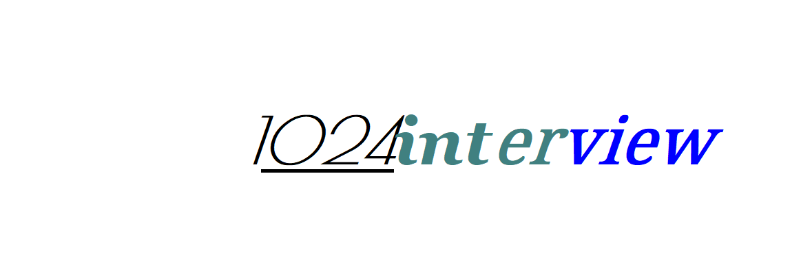

 

**JAVA programer interview dry goods (welcome to join the open source sharing)**

**JAVA程序猿笔试面试干货(欢迎加入开源分享)**

[](https://travis-ci.com/Byron4j/1024interview)

[](https://codecov.io/gh/Byron4j/1024interview)
[](https://scan.coverity.com/projects/17857)


<p><p>


## 🎉 面试题概览

✨ [JAVA程序猿笔试面试题概览](面试题概览.md)


- **1.Java 核心**

    - 1.使用过的java集合类有哪些？```ArrayList```、```LinkedList```的源码级别的差异。
    - 2.```Map```、```HashMap```、```ConcurrentHashMap``` 的区别、以及源码级别深度考察
    - 3.Java 锁机制的考查: ```Synchronized``` 关键字，```ReentrantLock```，```AbstractQueuedLongSynchronizer``` 的掌握
    - 4.Java 线程的考查： 线程的生命周期、线程间的通信
    - 5.```CountDownLatch```、```CyclicBarrier``` 的使用以及差异
    - 6.Java 线程池的掌握； 线程池的参数以及含义；自定义线程池；
    - 7.Java的阻塞队列 ```BlockingQueue```、```ArrayBlockingQueue```、```DelayQueue``` 等
    - 8.Fork join 框架、异步编程类： ```ForkJoinPool```、```ForkJoinTask```、```FutureTask```


最后希望每一位朋友面试后收到的反馈是：**Congratulations for you!**


>辑文参考资料
>
>- codecov代码覆盖率示例：https://github.com/codecov/example-java-maven

